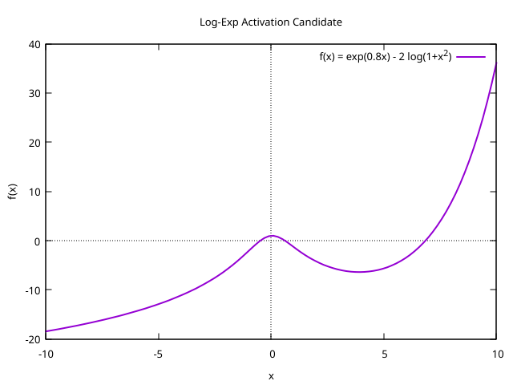

# LaserCortex — Typed Cortex, EML, and Tamari‑based Provenance

LaserCortex develops a typed “cortex” inspired by NormCode: a minimal, auditable formalism for pluralistic, paradox‑tolerant reasoning that records choice history as provenance. The project combines a small, rigorous Lean 4 core (formal types, Tamari contraction proofs, cost models) with Python + TypeScript tooling for visualization, execution, and agent infrastructure.

## Quick overview — the idea in one paragraph
A single binary primitive, EML (eml(x,y) = exp(x) − ln(y)) together with a terminal constant (`1`), suffices to express the standard elementary functions when composed into binary trees. LaserCortex treats each binary tree as a provenance record of ordering and coupling choices: a node written as `((a • b) • c)` is a canonical encoding of a genuinely ternary interaction T(a,b,c). Different bracketings are not merely syntactic variants but distinct histories — the Tamari lattice of rotations is the audit trail that catalogs alternative ternary resolutions. When EML parameters are non‑monotone (left amplification vs right compression), different bracketings become energetically distinct, turning the Tamari lattice into a meaningful geometry for analysis, optimization, and embedding.

## Key concepts (short)
- EML: eml(x,y) = exp(x) − ln(y). Minimal binary primitive for elementary functions.
- EMLTree: binary tree grammar S → 1 | eml(S,S). Leaves are terminals (1 or variables).
- Node-as-ternary: the nesting `((a•b)•c)` is read as a canonical encoding of T(a,b,c); Tamari rotations record alternative resolutions.
- Tamari lattice: the poset of bracketings under right‑rotation (contracts_one / contracts_to). It is the provenance space.
- Cost Φ: discrete asymmetric node cost (leftWeight, rightDiv, bias) that mirrors exp/ln asymmetry; Φ varies under rotation for non‑classical parameter regimes.
- Loday coordinates: an injective integer coordinate map from trees → lists, giving a concrete embedding (useful for visualization and continuous relaxations).

## Why this matters (intuition)
- Minimality + fidelity: A single uniform binary grammar compresses the algebraic diversity of elementary functions while preserving semantics via provenance (bracketing history).
- Geometry from non‑associativity: Non‑monotone EML parameters turn rebracketings into energetically distinct paths. The Tamari lattice becomes a discrete geometric landscape (metricizable via path costs) suitable for optimization, continuous relaxations, and novel applications (symbolic regression, neuro‑symbolic architectures, and exploratory links to domain problems).
- Activation/partition behavior: 1D scalarizations of `eml` can produce non‑monotone shapes (peak → trough → rise). Thresholding such slices can collapse multiple input regimes into fewer output bins (a many→fewer mapping), which has interpretive consequences for quantization, routing, and classifier design.

## Illustration: Log‑Exp activation (slice)


*Caption:* Log‑Exp activation (1D slice of eml): a peak followed by a trough and then a rapid asymptotic rise. This curve illustrates how a single scalar projection of the 2‑D EML surface can partition inputs into multiple qualitative regimes; when trees are embedded via Loday coordinates, discrete NodeCost parameters reproduce analogous regime boundaries on the Tamari lattice.

## What we formalize (Lean 4 core)
- `EMLTree` — binary tree inductive type (Leaf | Node).
- `contracts_one` — single Tamari rotation (primitive coupling rewrite).
- `contracts_to` — reflexive‑transitive closure (Tamari order, provenance).
- `rightComb` — canonical normal form; theorem that every tree contracts to its rightComb.
- `LodayCoords` — injective coordinate map from trees → integer lists.
- `Cost.Φ` — discrete per‑node cost parametrized by logic types (nodeParam), with proofs of invariants for particular regimes (classical-like invariance, bounds).

## Practical notes & caveats (important)
- Syntactic vs topological claims: Saying EML “reduces 3D→2D” is ambiguous. We recommend writing that EML is a syntactic/arity reduction (many primitives → 1 binary primitive) and that local parametrizations induce low‑dimensional search manifolds. Do not conflate that with an unqualified topological embedding theorem without a formal proof.
- Branches and partiality: `ln(y)` requires `y>0`; many EML reconstructions use complex intermediates or branch choices. Numeric evaluation and formal verification must handle these edge cases explicitly.
- Partition sums & path integrals: any path‑sum or partition‑function construction must restrict to finite path families or provide convergence arguments (e.g., truncate by path length or consider simple paths).
- Discrete approximation: `NodeCost.apply` is an integer approximation that captures exp/ln asymmetry qualitatively; it smooths singularities (division truncation), so interpret discrete and continuous behaviors with care.

## Quick start (developer)
Prereqs:
- Lean 4 + Lake (see LEAN_SETUP.md)
- Python 3.11+, Node 18+, npm 9+ (for canvas app)

Build the Lean core:
```bash
# From the repo root
lake build
```

Run the Canvas visualization:
```bash
cd canvas_app
python launch.py        # launcher will install deps and start frontend+backend
# or run backend and frontend separately as documented in canvas_app/README.md
```

Parse/verify a tree with the CLI (example uses the binary-bit encoding used in Main.lean; '1' = internal node, '0' = leaf):
```bash
# echo a binary tree bitstring into the Lean main runner or use the included scripts
# Example (in Main.lean): parse bitstring and print verified/failed for right‑comb contraction
```

## Status & roadmap
- Formal Lean core (EMLRegistry, LodayCoords, Cost) with many invariants proved.
- Canvas app provides interactive visualization and execution/debugging features.
- Next priorities:
  - Add decidable regime predicates (exp‑dominated / transition / log‑dominated) based on Φ and prove partition lemmas per fixed tree size.
  - Provide a small Node3/ternary wrapper and correspondence lemmas to make explicit ternary semantics where needed.
  - Reproducible notebooks that overlay Loday coordinates + Φ points on continuous `eml` slices (visual link between discrete and continuous views).
  - (Longer term) Formalize finite path sums / partition functions and controlled continuous relaxations for optimization experiments.

## How you can help / try it
- Explore the Lean files under `LaserCortex/` to see the precise definitions and proofs.
- Run the canvas app and load example trees to inspect the Tamari Hasse graph and per‑node costs.
- Try small experiments: map sampled trees (Loday coords) into R^n and evaluate `eml` on chosen coordinate pairs to see how discrete Φ aligns with continuous slices.

## License
AGPLv3 — see `LICENSE`.
