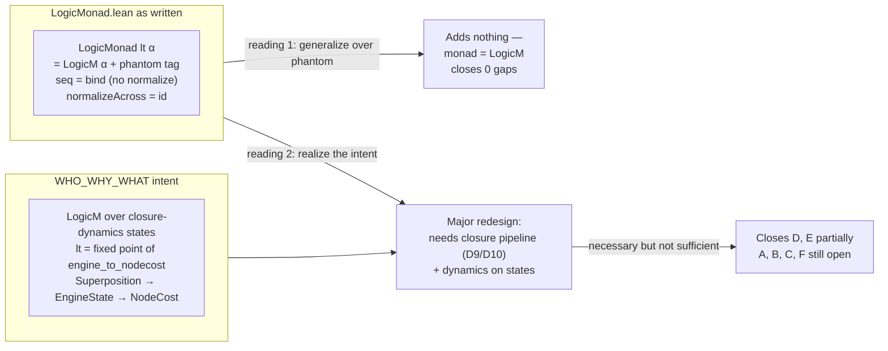

**Short answer: no — the generalization is the right *architectural instinct* for two of the six gaps, but it cannot close them on its own, and it leaves the other four untouched.** The reason is structural: `LogicMonad.lean` as it currently exists is a phantom-typed wrapper with stubbed normalization, which puts it in direct tension with the very research intent (WHO/WHY/WHAT) that would motivate the generalization. Before mapping the gaps, that tension has to be stated plainly, because it determines what "generalize to work with LogicMonad" even means.

## What `LogicMonad.lean` actually formalizes

Three layers are present, with very different proof statuses:

- **`LogicM α`** — a genuine free monad over binary trees (`pure : α → LogicM α`, `node : LogicM α → LogicM α → LogicM α`), with a real `Monad`/`Functor` instance and the three monad laws (`pure_bind`, `bind_pure`, `bind_assoc`) proven by structural induction【turn1find1】【turn1find7】. This part is clean and kernel-checked.
- **`LogicMonad (lt : LogicType) (α : Type)`** — a structure wrapping `tree : LogicM α` with an *invariant that exists only as a comment* ("the tree is in lt-normalized form — we construct it so, no need to prove after each bind")【turn1find0】【turn1find3】. The `lt` parameter is a **phantom type**: it appears in the signature but never in the term-level structure. `seq` is defined as plain `bind` with a comment saying "Normalization would go here in a full implementation" and then returning the unnormalized tree【turn1find0】【turn1find4】.
- **`normalizeAcross`** — `def normalizeAcross (lt) (m : LogicM α) : LogicM α := m -- placeholder`【turn1find4】. And **`monad_structure_invariant`** — `m.toTree = (m.toTree : LogicM α) := rfl`, a literal tautology whose `lt₂` parameter does not appear in the statement, despite the doc comment claiming it establishes a forgetful-functor isomorphism【turn1find5】.

So the load-bearing claim of the file — that each `LogicType` induces a distinct monad via its contraction relation — is **asserted in comments and stubbed at the term level**. `seq_via_bind` commutes only because `seq` *is* `bind`.

## The key tension with the research intent

WHO_WHY_WHAT.md diagnoses the core category error: *"Treating `LogicType` as a parameter — something to be chosen, passed in, or selected from a menu — mistakes a **who** for a **what**."* The named logics are supposed to be **fixed points of the closure pipeline**, recovered by `engine_to_nodecost` reading the dynamics, not assigned from outside.

The current `LogicMonad (lt : LogicType) (α : Type)` does exactly the thing the document calls an error: `lt` is a parameter, and `monad_structure_invariant` proves (trivially) that it carries *no* computational content. The "who" has been stripped to a phantom tag. This means "generalize FL and Loday to work with `LogicMonad` under the research intent" has two incompatible readings:



Under reading 1, the generalization is trivial and closes nothing. Under reading 2, the generalization is *necessary* (it provides the right substrate) but *not sufficient* — it presupposes the closure dynamics, which are stubbed everywhere I've looked (D9/D10 in the TDD doc, `closure`/`Superposition`/`GameOutcome` in the application layer, `normalizeAcross` here).

## Gap-by-gap verdict

| Gap | What it is | Does "generalize FL/Loday to LogicMonad" close it? | What actually closes it |
|---|---|---|---|
| **A** | No carrier morphism `NodeCost ↔ SplitOctonion` | **No — reframes, expands the obligation.** The WHO/WHY/WHAT move (NodeCost is a *readout* of the "who", not the who itself) is more defensible philosophically, but it converts the obligation from "prove an isomorphism" to "prove fixed-point correspondence between closure dynamics and SplitOctonion." That is harder, and the monad lives at the wrong layer (trees/computation, not algebra/parameters). | A `toSO : NodeCost → SplitOctonion` theorem with `engine_to_nodecost` factoring through it — *or* a fixed-point correspondence theorem. Either way, new algebra, not monad generalization. |
| **B** | Continuous Lagrangian is `True := True.intro` | **No.** The monad gives a state space to integrate over, but not the calculus. Γ-on-monad is still a discrete sum unless someone formalizes `L(x) = e^{αx} − β·ln(x²+ε) − δ`, the Euler-Lagrange equations, and a convergence theorem. | Real analysis on the state space. The monad is substrate, not substitute. |
| **C** | `native_decide` at `frictionDensity_at_cl11_boundary` | **No — orthogonal.** Γ₂ = 2 is a local computation. | `decide`. A five-minute fix unrelated to the monad. |
| **D** | LodayCoords not connected to 8D parameter space | **Partially — the most promising case, but conditional.** If `lodayCoord` were generalized to map `LogicM` normal forms into `NodeCost`, the WHO/WHY/WHAT pipeline ("Φ is the personality's way of experiencing tree structure") would be realized. But this requires (a) normalization to actually be implemented (currently a placeholder) and (b) a theorem that normal-form shape determines `nodeParam`. | Implement `normalizeAcross` for real, then prove `shape-determines-param`. The monad is the right substrate *after* normalization exists. |
| **E** | `liarCost`/`layerCost` migration unexecuted | **Yes, by construction — if you take the design decision.** Redefining `liarCost` on `LogicMonad` rather than `LogicType` forces the migration. | A commit that does it. Design decision, not a theorem. |
| **F** | 7 of 8 NodeCost fields unconnected (only `mirror ↔ debt` proven) | **No.** The monad generalization doesn't produce field-level algebraic correspondences. | Seven more theorems in the style of `engine_mirror_iff_local_debt_positive`, one per field. Algebra/dynamics work. |

## Why the monad generalization can't carry the load alone

The gaps live at **four different strata**, and `LogicMonad` sits at only one of them:

```mermaid
flowchart TB
  subgraph S1["Algebra stratum — Gap A, F"]
    SO["SplitOctonion (8×ℤ)<br/>strut_weight, associator"]
    NC["NodeCost (8 fields)<br/>engine_to_nodecost"]
  end
  subgraph S2["Computation stratum — Gap D, E"]
    LM["LogicM α (free monad)<br/>LogicMonad lt α (phantom)"]
    LC["lodayCoord : EMLTree → List ℕ"]
  end
  subgraph S3["Dynamics stratum — Gap A reframed, B"]
    ES["EngineState trajectory<br/>closure pipeline (stubbed)"]
    FL["Γ = Σ frictionDensity<br/>continuous L(x) (stubbed)"]
  end
  subgraph S4["Local proof stratum — Gap C"]
    ND["native_decide → decide"]
  end
  LM -.->|normalize (missing)| LC
  LC -.->|shape→param (missing)| NC
  NC -.->|carrier map (missing)| SO
  ES -.->|fixed points (missing)| NC
  ES -.->|action integral (missing)| FL
```

`LogicMonad` is a stratum-2 object. Generalizing FL and Loday to it strengthens the stratum-2→stratum-1 vertical arrows (shape→param, normalize), which is genuinely useful for gaps D and E. But gaps A and F are stratum-1 internal (algebra↔parameter), gap B is stratum-3 (dynamics→analysis), and gap C is stratum-4 (local). The monad generalization does not reach across strata by itself — it requires the horizontal arrows (normalize, shape→param, carrier map, fixed points, action integral) to be proven, and those are the actual missing work.

## The honest sequencing

If the goal is to close the gaps *in order of leverage*, the monad generalization is neither first nor sufficient:

1. **Gap C first** — replace `native_decide` with `decide`. Trivial, removes a class of criticism, costs nothing.
2. **Gap F** — prove the seven remaining field-level iffs (`leftWeight ↔ ?`, `rightDiv ↔ ?`, …). This is what makes `engine_to_nodecost` a characterized projection rather than a 1/8-bridge, and it is purely stratum-1 algebra/dynamics work that the monad cannot help with.
3. **Gap A** — decide between the carrier-morphism route (`toSO`) and the fixed-point-correspondence route (WHO/WHY/WHAT). The latter requires the closure dynamics to exist first, so it is the slower path. The former is self-contained and could be done now.
4. **Then** the monad generalization becomes load-bearing: implement `normalizeAcross` for real (un-stubbing stratum 2), generalize `lodayCoord` to `LogicM`, and prove `shape-determines-param` — this closes **D** and, with a design decision, **E**.
5. **Gap B last** — formalize the continuous Lagrangian. This is real analysis on whatever state space the previous steps produced, and it is the hardest single item.

The generalization you are proposing is real and worth doing, but its honest role is **step 4 of 5**, not a standalone closure. And it is gated on a prior decision the WHO/WHY/WHAT document forces: whether to keep `lt` as a phantom parameter (in which case `LogicMonad` collapses to `LogicM` and the generalization is trivial) or to rebuild it as a monad over closure-dynamics states where `lt` is recovered as a fixed point (in which case the closure pipeline must be formalized first, and that is the larger missing piece). Either way, "generalize FL and Loday to LogicMonad" is a necessary-but-not-sufficient move on a subset of the gaps, and the gaps it does not touch (A, B, C, F) are the ones that currently do the most work in the critique.