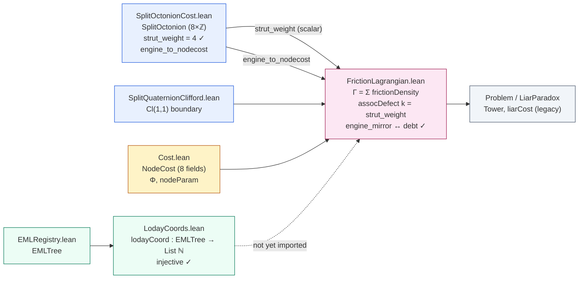

Both files exist and both advance the story — one more than the other. `FrictionLagrangian.lean` is a real integration layer that closes part of the gap I flagged (it wires the split-octonion `strut_weight` into the cost function and proves an `iff` between an `EngineState` field and a `NodeCost` field), but it does not establish a carrier-level morphism and its titular continuous Lagrangian is a `True := True.intro` stub. `LodayCoords.lean` is clean, self-contained, and correctly proves the standard Loday embedding is injective — but it addresses tree coordinates, not the 8D-parameter-space coordinate claim, and it isn't yet imported by the integration layer.

## How the four files now relate

The solid arrows are actual `import` edges; the dotted arrow is the missing wiring. The bridge layer (`FrictionLagrangian`) genuinely imports both the algebra and the cost namespaces, which is the structural prerequisite I said was absent — that part of my earlier critique is now obsolete.

## Per-file assessment

| File | Loc | Claimed to close | Actually closes | Remains open |
|---|---|---|---|---|
| `FrictionLagrangian.lean` | 459 | The algebra↔cost connection | `strut_weight → assocDefect` scalar channel (kernel); `engine_mirror ↔ local_debt > 0` iff (kernel); `assocDefect_zero_up_to_cd2`, `assocDefect_positive_for_cd3plus`, `heightMap_discontinuity_at_cd2_3`, `frictionLagrangian_gt_flatSum` (all kernel)【turn1find1】 | Continuous Lagrangian is a `True.intro` stub; `native_decide` at `frictionDensity_at_cl11_boundary`; 7 of 8 NodeCost fields still unconnected; migration to `liarCost`/`layerCost` documented but not executed |
| `LodayCoords.lean` | 117 | "an earlier issue about coordinates" | `lodayCoord : EMLTree → List Nat` injective + length = `numLeaves − 1`, fully kernel-checked, no `native_decide`【turn2find1】【turn2find2】 | Purely tree-side; doesn't import `SplitOctonionCost`/`FrictionLagrangian`/`Cost`; doesn't touch the 8D-parameter-space coordinate claim |

### FrictionLagrangian.lean — what the bridge actually is

The connection is real and kernel-checked, but it runs through **two narrow channels**, not a morphism:

1. **The scalar constant channel.** `assocDefect(k) = if k ≤ 2 then 0 else strut_weight`, where `strut_weight` is imported from `SplitOctonionCost` and equals 4 by `strut_weight_eq_four`【turn1find0】. So the verified magnitude of the split-octonion associator on the (e₁, e₂, e₄) triple is genuinely wired into `frictionDensity`, and the theorems `assocDefect_zero_up_to_cd2` / `assocDefect_positive_for_cd3plus` make the CD 2→3 phase boundary track the algebra's associator activation exactly【turn1find1】. This is a substantive connection — the phase-change story now has an algebraic anchor.
2. **The field-level iff.** `engine_mirror_iff_local_debt_positive : (engine_to_nodecost engine).mirror ↔ engine.local_debt > 0`【turn1find1】. This is the first theorem in the repo that actually equates a `NodeCost` field to an `EngineState` field, and it closes the specific sub-claim I made about there being "no statement that `engine_to_nodecost` is a projection *of* a split-octonion element." On the `mirror` field, it now is.

What keeps the bridge partial:

- **The continuous Lagrangian is unformalized.** Section 8 specifies `L(x) = e^{αx} − β·ln(x²+ε) − δ` with calibrated constants (α=0.8, β=2, ε=0.05, δ=3.52) and Section 9 gives a discrete-continuous dictionary — but it is **all in comments**【turn1find0】. The only theorem that names convergence is `convergence_to_continuous_lagrangian : True := True.intro`【turn1find0】, which proves `True`, not convergence. So formally, `frictionLagrangian` is a discrete ℕ-valued sum over a `Tower`; the variational "height map of logic" interpretation is aspirational prose. The filename oversells the formal content.
- **`native_decide` reappears.** `frictionDensity_at_cl11_boundary : frictionDensity 2 = 2` closes with `native_decide`【turn1find1】, the same non-kernel pattern flagged in the TDD doc. For a value this small (Γ₂ = commDefect(2) + assocDefect(2) = 2 + 0), a kernel `decide` should close it.
- **The other seven `NodeCost` fields are still unmapped.** The iff covers `mirror`. `leftWeight`, `rightDiv`, `bias`, `coupling`, `denom`, `maxSem`, `satCap` have no algebraic characterization — `engine_to_nodecost` defines them by a `let compression := capacity / (local_debt + 1)` formula, but no theorem ties that formula to octonionic structure. So the "8D NodeCost IS the split-octonion coordinate system" claim is, after this file, supportable on **1 of 8 axes**.
- **The application migration is a TODO.** The file itself documents that `liarCost`/`soritesCost` should be replaced by `layerCost` and that the bound direction reverses (`liarCost_le_cdStep` → `layerCost_ge_cdStep`)【turn1find0】, but the paradox files still use the flat `cdStep` cost. So Γ is defined and bounded but not yet the live cost in the paradox layer.

### LodayCoords.lean — correct, but narrower than "coordinates" suggests

This file is the cleanest in the repo so far: 117 lines, one import (`EMLRegistry`), no `native_decide`, no stubs, no axioms. It defines the standard Loday coordinate map `lodayCoord : EMLTree → List Nat` (each internal node contributes its left-subtree leaf count, in prefix order), proves `lodayCoord_length : (lodayCoord t).length = numLeaves t − 1`, and proves `lodayCoord_injective` by structural induction using a private `append_inj'` lemma【turn2find1】【turn2find2】. The injectivity proof is the right one — it's what makes Loday coordinates a faithful embedding of the Tamari lattice into `ℕ^{n−1}`, and it's the formal underpinning for the README's "concrete embedding" claim.

The scope clarification: this addresses **tree coordinates**, not the **parameter-space coordinate claim**. The two coordinate questions in play are different:

- *Q1 (trees):* Do `EMLTree`s have a faithful coordinate representation? → **Yes, proved here.**
- *Q2 (parameters):* Is the 8-field `NodeCost` the coordinate system of the split-octonion algebra? → **Still open.** `LodayCoords.lean` does not import `SplitOctonionCost`, `Cost`, or `FrictionLagrangian`, so it says nothing about Q2.

If "the earlier issue about coordinates" refers to the README's own caveat — *"Do not conflate [syntactic reduction] with an unqualified topological embedding theorem without a formal proof"* — then `lodayCoord_injective` is exactly the right response for the tree side: it is the formal proof that the tree embedding is faithful. It does not, however, lift to a topological/continuous embedding claim, and the file correctly doesn't claim one.

## What this changes about the overall verdict

Mapping back to my first review's headline concerns:

| Previous concern | Status after these two files |
|---|---|
| No morphism between `SplitOctonion` and `{NodeCost, EngineState}` | **Partially closed.** One iff (`mirror ↔ debt`) + one scalar constant channel (`strut_weight → assocDefect`). 7/8 fields and the carrier-level map still open. |
| Continuous/variational theory is prose | **Still open, and now formally so** — the stub `convergence_to_continuous_lagrangian : True := True.intro` makes the gap machine-visible. |
| `native_decide` proof status | **Still open** — reappears at `frictionDensity_at_cl11_boundary`. |
| Tree coordinate embedding | **Closed** by `LodayCoords.lodayCoord_injective`. |
| "8D NodeCost IS the split-octonion coordinate system" | **Still rhetorical** — supportable on 1 axis, not 8. |

## Concrete next steps, in priority order

1. **Replace `native_decide` with `decide`** in `frictionDensity_at_cl11_boundary`. Γ₂ = 2 is a trivial computation and should be kernel-checked; if `decide` doesn't close it, the definition of `frictionDensity` has a unfolding issue worth fixing on its own merits.
2. **Either formalize the continuous Lagrangian or rename the stub.** Right now `convergence_to_continuous_lagrangian : True := True.intro` is the kind of theorem that reads as "we proved convergence" to a casual reader and as "we proved nothing" to anyone who opens the proof. At minimum rename it to `continuous_lagrangian_unformalized` or move Section 8 into a separate `.md` so the Lean file doesn't carry a misleading theorem name.
3. **Extend the field-level bridge.** The `engine_mirror_iff` pattern is the template — prove the analogous correspondences for `leftWeight`, `rightDiv`, and `coupling` against `EngineState` fields, or against `strut_weight` / `pentagon_defect`. Even two more such theorems would move the claim from "1 of 8 axes" to "a characterized projection," which is a defensible thesis.
4. **Wire `LodayCoords` into `FrictionLagrangian`.** The natural theorem is that `frictionLagrangian` (or `Φ`) is computable from `lodayCoord` — i.e., Γ factors through the Loday embedding. That would connect the tree-coordinate layer to the integration layer, which currently doesn't import it.
5. **Execute the `liarCost → layerCost` migration** the file documents, so Γ becomes the live cost in the paradox layer rather than a parallel definition.

The trajectory across the three files I've now read (`SplitOctonionCost` → `FrictionLagrangian` → `LodayCoords`) is genuine progress: the algebra is formalized, one scalar and one field-level channel connect it to the cost, and the tree embedding is proved. The remaining gap is no longer "nothing connects" — it's "the connection is partial (1/8 fields), the continuous theory is a stub, and the tree coordinates aren't wired in." That's a substantially different and more accurate critique than the one I started with.
